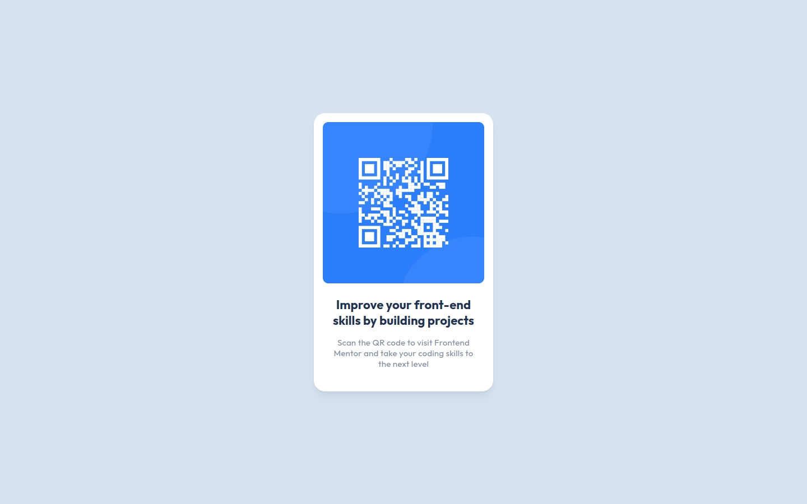

# Frontend Mentor - QR code component solution

This is a solution to the [QR code component challenge on Frontend Mentor](https://www.frontendmentor.io/challenges/qr-code-component-iux_sIO_H). Frontend Mentor challenges help you improve your coding skills by building realistic projects.

## Table of contents

- [Overview](#overview)
  - [Screenshot](#screenshot)
  - [Links](#links)
- [My process](#my-process)
  - [Built with](#built-with)
  - [Thoughts](#thoughts)
  - [Useful resources](#useful-resources)
- [Author](#author)

## Overview

### Screenshot

### Links

- Solution URL: https://www.frontendmentor.io/solutions/qr-code-component-with-good-ol-html-and-css-SuAyyNQGGo
- Live Site URL: https://joshjavier.github.io/qr-code-component-v2/

## My process

### Built with

- Semantic HTML5 markup
- CSS custom properties
- CSS Grid
- Mobile-first workflow

### Thoughts

This is a simple exercise in practicing the [rule of least power](https://en.wikipedia.org/wiki/Rule_of_least_power), or not using a cannon to hunt a rabbit, so to speak. It is so easy to fall into the habit of using a framework for _everything_ even when it's overkill for the task at hand. So for this solution, I used a single `index.html` file - no build step, no frameworks.

I did use CSS variables to make my component a little customizable. I've also thought about turning this into a web component, but ultimately felt it was unnecessary in this case.

In terms of accessibility, I decided to wrap the QR code image in a link, so if the image doesn't load (for users with slow internet) then they can still visit the link. Of course, this doesn't cover edge cases for when QR codes refer to actions other than visiting a link.

## Author

- Website - [Josh Javier](https://joshjavier.com/)
- Frontend Mentor - [@joshjavier](https://www.frontendmentor.io/profile/joshjavier)
